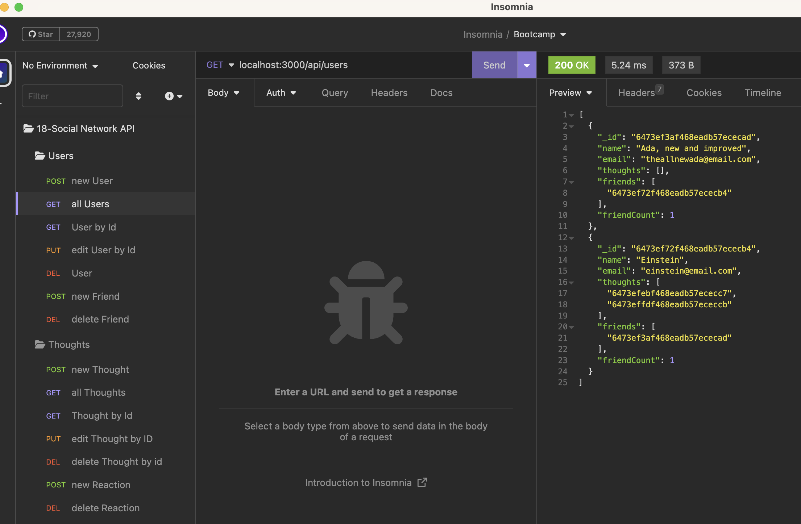

# 18: MongoDB Social Network API     

## Description

The API for a Social Network, with full CRUD functionality for Users, Thoughts, and Reactions. Built with MongoDB, Mongoose, and Express.js.    
  

## Table of Contents

- [Installation](#installation)
- [Usage](#usage)
- [License](#license)
- [Tests](#tests)
- [Credits](#credits)
- [How to Contribute](#how-to-contribute)
- [Questions](#questions)

## Installation
NOTE: Requires [Node.js](https://nodejs.org/en) and [MongoDB](https://www.mongodb.com).
1. Clone the repo to your local machine.  
2. With the cloned location as the active directory, install the npm dependencies from terminal with the command: `npm i`.  

## Usage

With the cloned location as the active directory, start the server from terminal with the command `npm start`.  
From the client side (i.e. from a browser or a REST API client like Insomnia), interact with the database at: http://localhost:3000.  
Create, read, update, and delete database entries using the following endpoints/methods:  
### Users:
- GET     /api/users     --read all Users
- GET     /api/users/`userId`     --read single User with `userId`
- POST     /api/users     --create a new User with a JSON body:   
   { 
    "name": "`string`",
    "email": "`string`"
    }
- PUT     /api/users/`userId`     --update a User with a JSON body:   
   { 
    "name": "`string`",
    "email": "`string`"
    }
- DELETE     /api/users/`userId`     --delete single User with `userId`  

### Friendships
- POST     /api/users/`userId`/friends/`friendId`     --create a new friendship between two users
- DELETE     /api/users/`userId`/friends/`friendId`     --delete the friendship between two users

### Thoughts
- GET     /api/thoughts     --read all Thoughts
- GET     /api/thoughts/`thoughtId`     --read single Thought with `thoughtId`
- POST     /api/thoughts     --create a new Thought with a JSON body:  
   {  
     "thoughtText": "`string`",  
     "userId": `string`,  
    }
- PUT     /api/thoughts/`thoughtId`     --update a Thought with a JSON body:   
   {  
     "thoughtText": "`string`",  
    }
- DELETE     /api/products/`thoughtId`     --delete single Product with {product_id}  

### Reactions
- POST     /api/thoughts/`thoughtId`/reactions     --create a new reaction to a Thought
- DELETE     /api/thoughts/`thoughtId`/reactions/`reactionId`     --delete the Reaction from the Thought

See [Walk-Thru Video]() for a detailed walk-thru of installing and using the API with sample data using VS Code's Integrated Terminal and Insomnia REST API Client.

## License

This project is covered under the following license: MIT License  
Refer to LICENSE in the repo for additional details.

## Tests

N/A

## Credits

N/A

## How to Contribute

[Contributor Covenant](https://www.contributor-covenant.org/)

## Questions

For questions or suggestions, contact:  
GitHub: [@aerostokes](https://github.com/aerostokes)  
Email: [rhonda@aerostokes.com](mailto:rhonda@aerostokes.com)